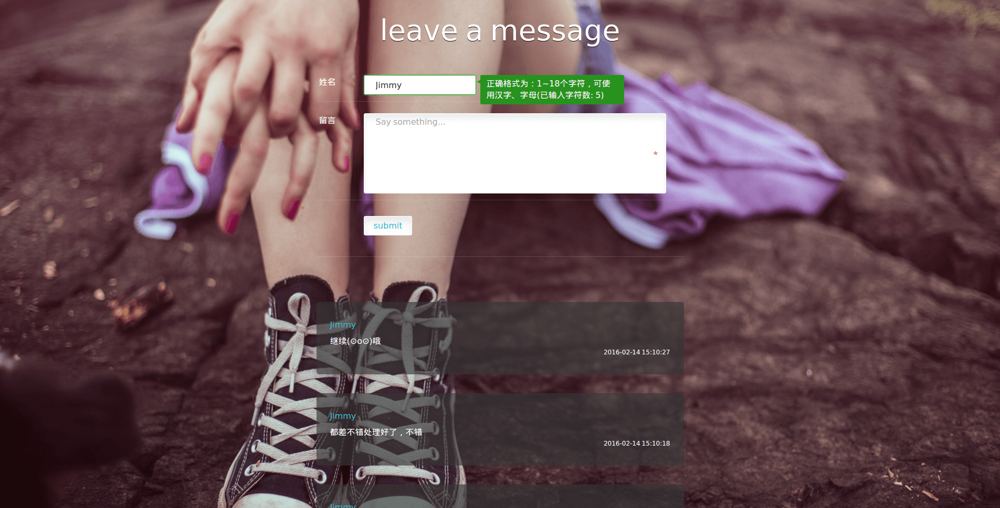
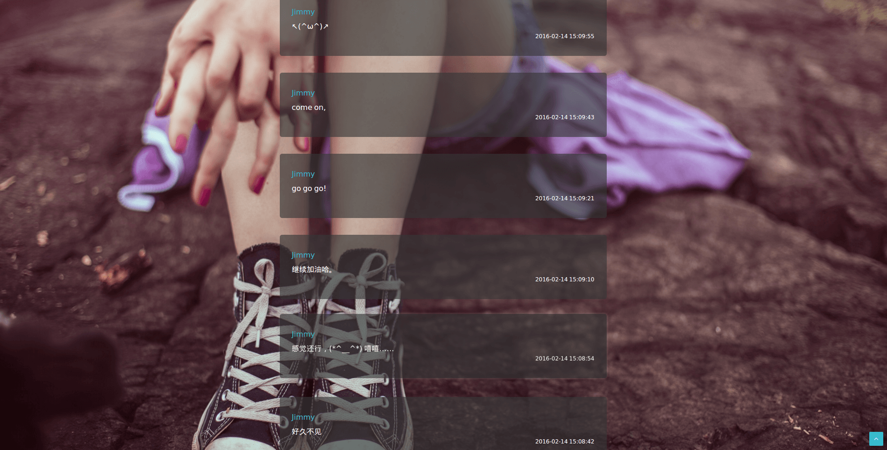

# MessageBoard

## 最终效果

## 使用技术

- `react`
- `less`
- `node`
- `gulp/webpack/bower`

## 项目总结

### 总体概述

- 前端

    - 前端部分首次学习并使用 `react` ，接触组件化的构建方式。

- 后端

    - 通过 `http` 模块启动服务器
    - 并通过 `req.url` 进行路由判断并执行相应的处理
    - 通过 `mongodb` 模块进行数据库的连接及操作

### HTML

- 亮点

    - 根据 `语义` 和 `DOM树的层级关系` 来定义合适的类名和ID，类名中采用中划线(-)、ID中采用下划线(_)进行连接，并且如果需要作为 javascript 调用的钩子时，在相应的名称前面添加 `js` 前缀

### 样式处理

- 亮点

    - 首次尝试使用模块化的构建方式，并通过 `gulp-concat` 进行文件的 `concatenation`

    - header 部分
    
        - 使用了 `text-shadow: 0 1px #000;` 使用字体产生刻印的效果
        
    - main.form 部分
    
        - `textarea` 与包含元素之间的空白间隙处理
        
            - `textarea` 的基线部分位于其底线，又由于其属于 `inline-block` ，所以默认的情况下是基线对齐，这种情况下由于其后面跟随了一个空白字符的原因，所以就会和包含块 `div` 之间因行高的不同而产生不同的空白间隙。
            - 可以通过设置为 `display: block` ，但是在这里是不符合效果的。可以通过设置 `line-height: 0` 或　`font-size: 0` 来达到效果，但是这样会增加样式处理的复杂程度。由于默认的情况下是 `vertical-align: baseline` 所以可以通过改变 `vertical-align` 为其他的值既可以达到效果。
        
    - main.list 部分
    
        －借助与 `react-addons-css-transition-group` 实现动画效果
        
### JavaScript 交互

- 亮点

    - 良好的表单交互效果
    - 原生 `js` 实现跨浏览器的事件处理
    - 交互效果非常好的 `back to top` 按钮
    - 通过 `throttle` 节流，提高性能，避免出现界面交互无效的现象（其实这里不加，根本也体现不出来）
